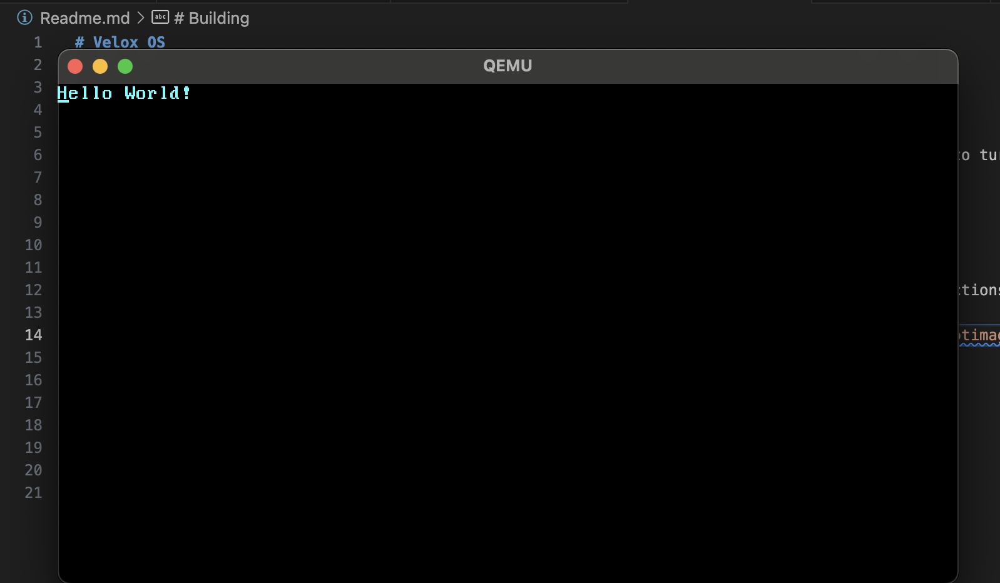

# Velox OS

Velox is a **work in process** minimal Operating System built in **Rust** as a hobby project for 
low level systems engineering (in Rust).

With thanks to the guide at [phil-opp.com](https://os.phil-opp.com/minimal-rust-kernel/). I hope to turn
this project into a more fleshed out OS for funsies, beyond the start-up topics from the linked blog! :)

[mit.edu](https://pdos.csail.mit.edu/6.828/2018/labs/lab1/index.html) also has some great resources for basic OS dev!

# Building

To build, we use the [bootloader](https://crates.io/crates/bootloader) crate (pinned to v0.9) and 
running `cargo bootimage` from within the project crate. See requirements for installation instructions.

After executing `cargo bootimage`, there should be a bootable image at `/target/x86_64-velox/*/bootimage-velox.bin`.

To run (assisted, ensure qemu installed): `cargo run`.

To run (un-assisted): `qemu-system-x86_64 -drive format=raw,file=target/x86_64-velox/debug/bootimage-velox.bin`.

# Requirements

- `rustup override set nightly`
- `rustup component add rust-src`
- `rustup component add llvm-tools-preview`
- Install [QEMU](https://www.qemu.org/download/):
  - MacOS: `brew install qemu`
- (from outside the cargo project) `cargo install bootimage`